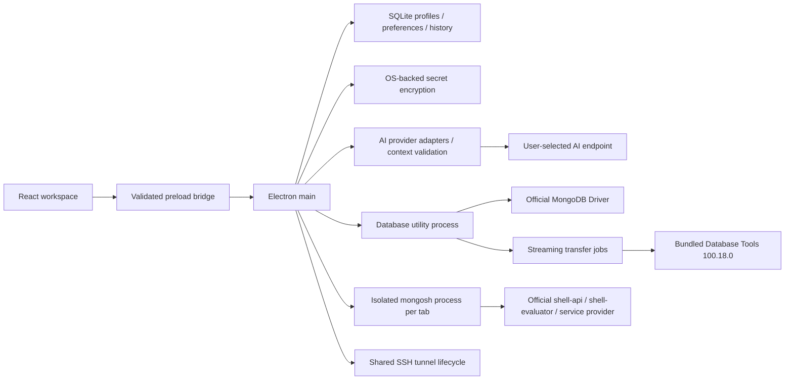

# 架構

Renderer 不持有 MongoClient、不接觸檔案系統或 Node.js，也不執行使用者 JS。開啟 contextIsolation、sandbox、CSP，拒絕導覽、新視窗與權限要求。IPC 檢查來源 main frame，command 和 payload 由 Zod 驗證；內部 RPC 帶請求 ID、逾時與工作結果事件。

AI provider keys stay in Electron main and are encrypted by `safeStorage`; renderer receives provider metadata only. The main process sends field paths/types, literal-redacted existing queries, selected Explain metrics/stages, and the user's prompt. Schema samples are collected locally on demand and discarded after extracting field paths/types. Each connection is opt-in, remote endpoints require application-wide consent, requests can be cancelled, and generated aggregation drafts pass the existing read-only pipeline validator before the renderer can apply them.

`src/shared/contracts.ts` 定義命令與輸入；`core/database.ts` 管理连接池和 cursor；`core/shell.ts` 在每分頁專用程序使用官方 mongosh API；`core/transfers.ts` 負責背壓、批次寫入與程序取消。Shell 的 top-level await 以 Babel AST 配合官方 auto-await evaluator 處理，保留函式內 await。

資料庫程序保留 BSON。跨程序使用 Canonical Extended JSON，普通文件結果附明確連線、namespace、識別鍵及可編輯性。更新使用 compare-and-set 條件及重新讀取；不根據 JS 任意結果推測寫入對象。

每個 Driver pool 上限 5 連線；cursor 預設 100 筆／批、單批約 8 MB，閒置五分鐘關閉。Renderer 最多保留約 24 MB／1,000 筆；一份超大文件本身仍可能超過單批軟上限。Table 同時虛擬化列與欄，Tree 延遲展開，JSON 編輯器限定每頁 100 筆並保留實例。傳輸最多同時兩個工作。

SQLite schema 使用 `user_version=6`，profiles 與 secrets 分欄。safeStorage 沒有安全後端時不保存秘密，Linux `basic_text` 明確禁止。SSH tunnel 共用生命週期，私鑰不複製到 SQLite。BSON 工具透過權限受限的臨時 config 檔接收憑證，不放在程序參數列；結束後刪除。

測試使用真實 MongoDB 程序、真實 ssh2 server、測試 CA 及 Playwright Electron。資料單元測試不代替遠端 Atlas／Cosmos 與各作業系統實機驗收。

## 維護邊界

- Shell 是有權限的資料庫工作工具，請只執行信任的程式。程序隔離提供取消及故障隔離，不將 Node vm 視為不可信 JS 的安全邊界。
- GUI 已區分安全查詢結果與唯讀結果。任意 Shell JS、企業 Kerberos／OIDC／SSO、視覺化 Aggregation 與 SQL 未列入 GUI 功能。
- GUI 對 Cosmos 的能力限制集中於 `shared/capabilities.ts`，命令錯誤／節流有專用說明。帳號能力仍需專用 Cosmos 環境驗收；BSON 路徑預設關閉。AI 首版限 Cosmos 的 find 草稿，不提供 Explain 或 aggregation 判讀。
- 匯出是邏輯資料匯出，未取得跨 Collection 的一致性快照。資料庫持續變動時，不應當作可保證時間點一致性的正式備援方案。
