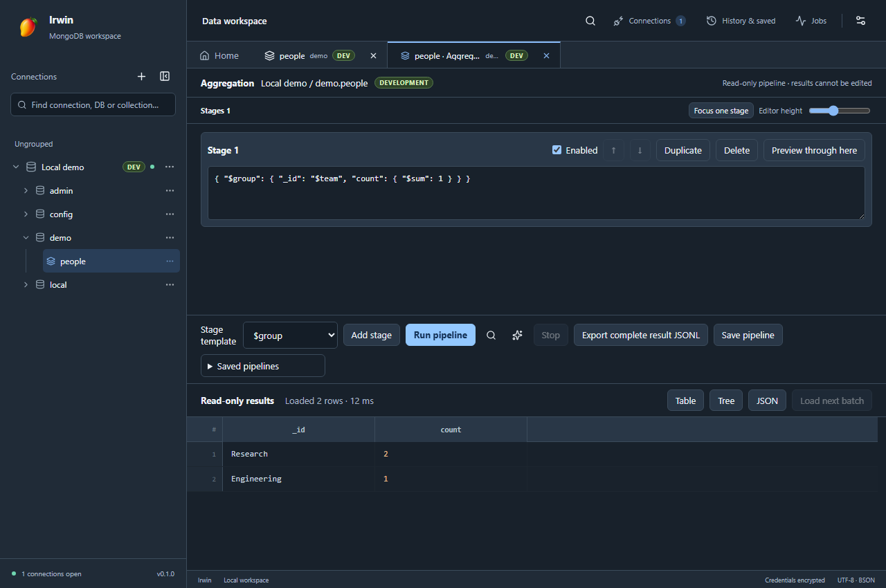

# 查詢與資料探索

本指南說明查詢工作區、資料探索與跨環境比較的操作方式及限制。

## 工作區與鍵盤操作

- Collection 查詢保持 Filter 與「執行」在主區域；按「查詢選項」可收合或展開 Sort 與 Projection。右下角 BATCH 控制每次載入筆數，透過分頁可繼續檢視所有符合條件的文件。
- 查詢後按「專注結果」可暫時收起編輯器與輸出，將空間留給 Table／Tree／JSON；按「返回查詢」還原。這是目前分頁的畫面選擇，不會清除條件或重新執行。
- 表格欄名可取得鍵盤焦點，按 Alt+←／→ 在同一凍結群組內移動欄位；在欄位邊界按 ←／→ 調整 16 px，Shift 加方向鍵調整 48 px。欄位設定側欄也列出這些操作提示。
- Aggregation 可切換「單階段檢視」，以「上一階段／下一階段」逐一編輯；「編輯區高度」調整階段區，窄視窗仍為結果保留空間。階段的上移／下移、停用、複製、刪除均可透過按鈕操作。「已儲存的 Pipeline」與傳輸範本各自收在可展開區域。
- 查詢不設總筆數 LIMIT；BATCH 是每次載入筆數，分頁可逐批檢視全部符合條件的文件。畫面保留最近 1,000 筆／24 MB 以控制記憶體，亦可回到前批重新載入；完整匯出使用串流。
- 連線設定首頁顯示環境與唯讀狀態，可直接前往進階設定。傳輸視窗先列目標與模式，開始前再次顯示摘要。操作收據與 Schema／比較視窗可調整尺寸，結果列表會延伸使用可用高度；操作收據可依連線／目標文字、狀態、環境與日期篩選，匯出的 JSON 保留結構化原始欄位。
- 偏好設定的「依照系統切換」會跟隨作業系統的深色／淺色外觀設定；淺色使用芒果暖色主題，深色使用深色主題。移除右上角的快速切換按鈕後，主題統一由偏好設定管理。

## Aggregation

在 Collection 右鍵選 Aggregation 開啟獨立分頁。可新增 `$match`、`$project`、`$group`、`$sort`、`$limit`、`$unwind`、`$lookup` 範本，並在每一階段編輯原生 JSON／Extended JSON；可停用、複製、刪除及調整順序。停用的階段不送往資料庫。

「預覽至此」只在使用者按下後執行目前階段以前的 pipeline，最多取 20 筆；「執行」分批取回結果，Table／Tree／JSON 均唯讀，按「下一批」繼續讀取。Explain 顯示伺服器回傳的計畫與統計，並非自動替 pipeline 調校。切換連線、取消或逾時會停止目前讀取。

儲存 pipeline 時會保存目前階段與停用狀態。套用到其他 Collection 只填入編輯器，不自動執行；其中寫死的 namespace、欄位或 `$lookup.from` 需自行檢查。匯出完整結果建立背景 JSONL 工作，與目前畫面已載入的批次不同；取消或失敗留下 `.partial`，不可當成完整匯出。

Aggregation 執行、預覽、Explain 與匯出都會在前端和資料庫程序檢查 pipeline；`$out`、`$merge`、未知或可能寫入的階段均被拒絕，巢狀 `$lookup.pipeline`／`$facet` 也套用相同限制。最多 50 個階段、1 MB pipeline。本版採保守唯讀設計，尚未提供視覺化欄位連線、拖曳資料流或效能建議。

## Production 寫入與操作收據

新建或切換到 Production 環境時預設唯讀。要儲存可寫 Production 連線，必須手動解除唯讀並輸入連線名稱。正式環境仍應使用資料庫端最小權限帳號；介面確認不能取代伺服器權限。

匯入取代、drop、整個資料庫還原，以及 Production 可寫匯入，開始前須輸入完整 `database.collection` 或 database 名稱。確認畫面列出目標、模式與可能部分成功；未知的影響筆數不會顯示成精確值。背景任務及 GUI 寫入的結果可在「任務 → 操作收據」查閱、匯出 JSON 或清除。收據僅留在本機，最多 500 筆且最多 90 天，只含連線名稱、環境、目標、動作、狀態與已知的數量／檔名，不含 URI、密碼、文件內容或錯誤全文。程序中斷後無法確認的結果標成「未知」；它不是資料庫稽核日誌。

## 查詢提示與快速篩選

- FILTER／SORT／PROJECTION 支援拖曳欄間邊界調寬、右下角調高、格式化（Shift+Alt+F）及可放大的獨立編輯器；展開時自動格式化有效文件，套用不會直接執行查詢。
- Filter／Sort／Projection 輸入欄位名稱時會顯示提示；方向鍵移動提示，點擊項目插入，Esc 關閉，Ctrl+Space 主動提示。Enter（包含 Ctrl/Cmd+Enter）會在欄位中換行；按 F5 或畫面上的「執行」按鈕才會查詢。Tab 插入偏好設定的空格數，Ctrl+Tab 取消一層縮排。
- 自由命令／Shell 的 Monaco 編輯器提供目前 DB 已載入的 Collection 名稱、查詢結果前 100 筆中的欄位與 BSON 型別，以及常用 MongoDB operator、方法參數和 ObjectId／日期範例。提示不會掃描完整資料庫，取樣沒有出現的欄位仍可手動輸入。
- 在 Table cell 按右鍵可選「只顯示此值」「排除此值」「加入 AND／OR 條件」。日期另有「今天（本機時區）」與「最近七天」。這些操作會更新 Filter，按執行才查詢。
- ObjectId、Int64 等值保留 Canonical Extended JSON 型別；Null 與缺少欄位分開處理。欄名含字面句點或 `$`、無法安全表示成 MongoDB path 時停用快速篩選。

## 表格操作

- 點擊欄名循環切換升冪、降冪與不排序。SORT 旁的清除按鈕會清除全部排序並重新查詢；箭頭直接反映 SORT 文字，不另存不同步的排序狀態。執行期間暫停接受新的欄名排序操作。
- 欄序按分頁首次看到的欄位建立，之後排序沿用欄位位置和寬度；新欄位追加在後方。暫時由 Projection 省略的欄位再次出現時保留原有配置。
- 拖曳欄名可調整順序；拖曳欄位邊界可調整寬度。
- cell 右鍵「凍結此欄」，或在欄位設定中按菱形按鈕，可把欄位固定在左側；再次操作即可取消。凍結區使用原生固定定位，水平捲動時不會露出後方資料。
- Table／Tree／JSON 工具列右側的「欄位設定」圖示開啟獨立側欄，表格會縮小以騰出空間，不覆蓋資料。可勾選要顯示的欄位；再次點圖示或側欄的關閉按鈕即可收合。
- 欄位設定中的 `+`／`−` 可展開或收合物件、陣列的子欄位。最多呈現 500 欄、每層取前 100 個子鍵，避免龐大資料破壞介面效能。
- 點擊選取單一 cell，Ctrl+C／macOS Cmd+C 複製完整值；字串保留原文，複合值與特殊 BSON 使用 Extended JSON。方向鍵移動目前選取位置。矩形選取與區域 TSV 複製已移除，Shift 操作不會擴張選取範圍。
- 每次新開啟 Collection 都會依首次查詢的資料縮小短欄位，後續查詢保留欄寬。勾選「記住此 Collection 的欄位配置」會保留欄序、隱藏／凍結及展開狀態；欄寬仍在每個新分頁依資料重新計算。

## 搜尋與工作區

- 查詢工具列「儲存查詢」保存 Filter、Sort、Projection、Batch 及來源說明，可自訂名稱、群組／資料夾與描述。條件保留 MongoDB 原始文字與 BSON 表示法。
- 點擊旁邊資料夾圖示，或「歷史與收藏 → 已儲存查詢」，可依名稱、群組、來源或條件搜尋；群組可收合，編輯可改名、移組及修改條件，刪除需確認。舊收藏仍在歷史頁籤中。
- 跨環境使用時先開啟目標連線的 DB／Collection 分頁，再按「套用到目前分頁」。目標會列在面板中；套用填入條件，不執行查詢。確認後按執行即可查目標環境。範本獨立存於 SQLite，程式重啟清空分頁不會刪除範本。
- Shell 也可儲存與套用原始程式；其中明確寫出的 DB／Collection 名稱不會自動改寫，執行前請檢查。

- Collection 右鍵選「在新分頁開啟」，或按住 Ctrl／macOS Cmd 點擊 Collection，可同時開啟同一 Collection 的多個查詢分頁。重複分頁顯示獨立的 `1`、`2` 等序號，名稱縮短時序號仍保持可見；各自保留 Filter、Sort、檢視模式、結果及欄位操作狀態。一般點擊會聚焦目前已開啟的對應分頁。
- 左側搜尋涵蓋已連線且已載入的 DB／Collection 名稱。
- Ctrl+P／Cmd+P 開啟 Collection 搜尋；Ctrl+Shift+P／Cmd+Shift+P 開啟命令面板。右上角搜尋 icon 也可開啟命令面板。
- 搜尋只使用已快取的 metadata；若找不到 Collection，先連線並展開所屬 DB。
- 每次啟動都從乾淨的分頁表開始，不會還原先前的 Collection、查詢或 Shell。側欄與下方面板尺寸會保存。
- 設定採短延遲寫入 SQLite；系統斷電／強制終止前最後尚未保存的介面尺寸仍可能遺失。

## Explain

按查詢工具列的 Explain，再按「執行／再次比較」。會執行目前查詢取得 executionStats，顯示回傳筆數、掃描文件／索引鍵數、耗時、掃描／回傳比例、COLLSCAN 與使用的索引。

可直接在 Explain 內調整 Filter／Sort／Projection，保留最近兩次結果並排比較；可切換為原始 JSON。關閉對話框即清除這兩次分析。查詢遵守時間上限；服務不支援時顯示原始錯誤，沒有數據時顯示 `—`，不臆測數值。耗時會受快取與伺服器負載影響。

## Schema 與資料品質

在 Collection 按右鍵，選「Schema 與資料品質」。指定 Filter、樣本量及時間上限後執行。

- MongoDB 隨機取樣，Cosmos 使用前 N 筆符合條件的文件。
- 最多 1,000 筆／8 MB／500 條欄位路徑；超過上限或無法安全表示的特殊路徑會標示部分分析。
- 顯示型別分布、缺少／Null 筆數、常見值、日期／一般數值範圍，以及陣列長度。Int64／Decimal128 保留型別，不轉為 JavaScript 浮點數推算範圍。
- 點常見值或缺少／Null 數量可在正確的來源 Collection 建立 Filter；仍需按執行查詢。
- 比例僅代表實際樣本，不是整個 Collection 的統計估計。可匯出 JSON 報告。

## 跨環境比較

Collection 右鍵選「跨環境資料比較」，設定來源／目標連線、DB、Collection、各自 Filter、比對鍵與忽略欄位。

- 唯讀讀取所有符合條件的文件；本機暫存 SQLite 保存待比對資料，分批讀取並限制記憶體快取。
- 預設依 `_id` 比對，可設定多個鍵，例如 `tenantId, sku`；巢狀欄位使用點路徑。
- 嚴格比對 BSON 型別，Int32(1) 與 Int64(1) 視為不同。物件鍵順序不影響比較，陣列順序會影響。
- 分別列出相同、不同、僅來源、僅目標、重複鍵組及缺少比對鍵的文件。重複／缺少鍵不會被當成唯一對應文件。
- 成功完成時，數量涵蓋全部符合條件的文件；畫面與 JSON 報告的差異清單最多保留 500 項／8 MB，截斷時明確標示。
- 報告保存來源與目標各自開始／結束讀取時間、Filter、比對鍵、忽略欄位、全量計數及差異清單截斷狀態；畫面可展開查看這些條件。取消時不輸出完成報告。
- 這不是同一時間點的資料庫快照；服務持續寫入時，前後讀取仍可能反映不同時刻。取消／逾時會停止工作，不提供不完整的成功報告。本版沒有同步寫入功能。

## 傳輸範本

Collection／DB 的匯入匯出視窗可命名、儲存、套用及移除範本，保存連線、namespace、方向、格式、查詢、模式與 CSV 型別／欄位映射。

套用範本後必須重新選擇檔案或目錄，覆蓋還原的確認與 drop 選項會重設。視窗摘要會列出目前連線及 DB.Collection；確認目標及模式後按開始任務。範本不會保存密碼、檔案授權或直接排程執行。
